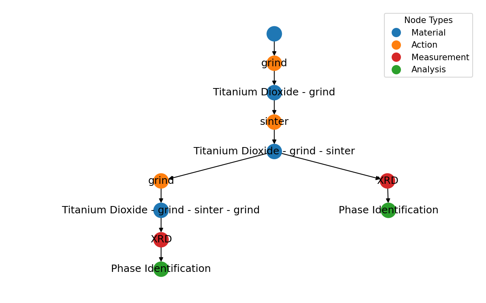

.. ALab Data documentation master file, created by
   sphinx-quickstart on Tue Nov 22 09:49:05 2022.
   You can adapt this file completely to your liking, but it should at least
   contain the root `toctree` directive.

.. note::
   This project is under active development.

Welcome to ALab-Data's documentation!
=====================================
**ALab-Data** is a Python library for storing and retrieving materials science data stored in MongoDB. This library enforces a data model tailored for experimental materials data (computational or physical experiments). 

At a high-level, data is stored as a directed graph of four node types: :py:class:`Material <alab_data.Material>`, :py:class:`Action <alab_data.Action>`, :py:class:`Measurement <alab_data.Measurement>`, and :py:class:`Analysis <alab_data.Analysis>`. The content of these nodes is up to you -- we just make sure that any data you enter results in a valid graph.

   
   This is a graph for a single Sample. Learn more in the :doc:`schema` section.

Node Types
"""""""""""
Here is a brief overview of the four node types and their roles in the data model. Further details on allowed node relationships can be found in the :doc:`schema` section.

- :py:class:`Material <alab_data.Material>` nodes are the fundamental building blocks of the data model. These represent a material in a given state. 

- :py:class:`Action <alab_data.Action>` nodes are operations that generate :py:class:`Material <alab_data.Material>`s. :py:class:`Action <alab_data.Action>` nodes have incoming edges from any input :py:class:`Material <alab_data.Material>`(s) and outgoing edges to generated :py:class:`Material <alab_data.Material>`(s). An :py:class:`Action <alab_data.Action>` can generate :py:class:`Material <alab_data.Material>`(s) without consuming any input :py:class:`Material <alab_data.Material>`(s), as may be the case when procuring a :py:class:`Material <alab_data.Material>` from a vendor or receiving a :py:class:`Material <alab_data.Material>` from a collaborator. 

- :py:class:`Measurement <alab_data.Measurement>` nodes act upon a :py:class:`Material <alab_data.Material>` node to yield some form of raw data.

- :py:class:`Analysis <alab_data.Analysis>` nodes act upon :py:class:`Measurement <alab_data.Measurement>` and/or :py:class:`Analysis <alab_data.Analysis>` nodes to yield some form of processed data.

Samples = Graphs
"""""""""""""""""
As materials scientists, we execute sets of :py:class:`Action <alab_data.Action>`s, :py:class:`Measurement <alab_data.Measurement>`s, and :py:class:`Analysis <alab_data.Analysis>` to synthesize and study :py:class:`Material <alab_data.Material>`s. In **Alab-Data**, one such set of nodes is referred to as a :py:class:`Sample <alab_data.Sample>`. A :py:class:`Sample <alab_data.Sample>` is simply a graph of nodes that captures the steps performed in an experiment. In typical usage, we will enter nodes into the database as part of a :py:class:`Sample <alab_data.Sample>`. This achieves a few things:

- We can ensure that the graph we are entering is valid (i.e. it is a directed acyclic graph (DAG) with no isolated nodes).

- Given a node, we can easily retrieve the most related nodes that belong to the same :py:class:`Sample <alab_data.Sample>`.

- We can record any :py:class:`Sample <alab_data.Sample>`-level metadata (e.g. sample name, sample description, sample author, etc.).

Database Backend
""""""""""""""""""""""
**ALab-Data** uses `MongoDB <https://www.mongodb.com/>`_ as our backend database. We communicate with the database
using the `pymongo <https://pymongo.readthedocs.io/en/stable/>`_ package.

Quickstart
"""""""""""
.. toctree::
   :maxdepth: -1
   
   Schema<schema>
   Entering Data<entering_data>
   Retrieving Data<retrieving_data>
   .. Node Types<node_types>

   

.. Indices and tables
.. ==================

.. * :ref:`genindex`
.. * :ref:`modindex`
.. * :ref:`search`
