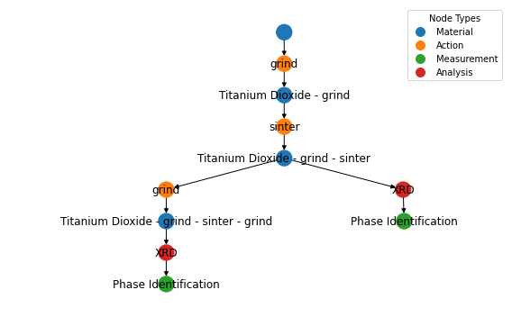

Schema Overview
================

All data is stored as a `directed acyclic graph (DAG) <https://en.wikipedia.org/wiki/Directed_acyclic_graph>`_. The "direction" of edges encodes the order that nodes (ie experimental steps) were performed in. Put another way, edges always point ahead in time. The "acyclic" constraint ensures that nodes cannot connect upstream to older nodes, which would be travelling back in time!

The four :ref:`node types <node-types>` are designed to cover capture the generation of materials, the measurement of these materials, and analysis of these measurements. 

   
   This is a graph for a single Sample. The four node types are shown in different colors. The edges point forward in time, and the nodes are arranged in a topological order. The graph is acyclic, so there are no loops. The graph can branch to show multiple downstream processes (in this case, an :py:class:`Action <labgraph.Action>` and :py:class:`Measurement <labgraph.Measurement>`) acting upon a single :py:class:`Material <labgraph.Material>`.

Allowed Edges (Node Relationships)
===================================
Each :ref:`node type <node-types>` can only be connected to certain other node types. The allowed edges/relationships are described below.

###############
Material Nodes
###############

:py:class:`Material <labgraph.Material>` nodes represent a material in a given state. Every :py:class:`Material <labgraph.Material>` node follows an :py:class:`Action <labgraph.Action>` node describing how the :py:class:`Material <labgraph.Material>` was generated (whether this is an experimental :py:class:`Action <labgraph.Action>` or simply procurement of a reagent from a supplier). A :py:class:`Material <labgraph.Material>` node can be followed by either an :py:class:`Action <labgraph.Action>` (e.g. where the :py:class:`Material <labgraph.Material>` is an input to an experimental step) or a :py:class:`Measurement <labgraph.Measurement>` (e.g. the :py:class:`Material <labgraph.Material>` is the subject of some test or characterization).

###############
Action Nodes
###############
.. figure:: img/action_allowed_edges.png
   :scale: 100 %
   :alt: Allowed edges for Action nodes.

:py:class:`Action <labgraph.Action>` nodes bridge :py:class:`Material <labgraph.Material>` nodes. An :py:class:`Action <labgraph.Action>` will always generate at least one :py:class:`Material <labgraph.Material>`. The :py:class:`Action <labgraph.Action>` may also take incoming edges from :py:class:`Material <labgraph.Material>`(s), indicating that the upstream :py:class:`Material <labgraph.Material>`(s) were required to perform the :py:class:`Action <labgraph.Action>`. For example, a "mixing" :py:class:`Action <labgraph.Action>` might use upstream "solvent" and "reagent" :py:class:`Material <labgraph.Material>`s to generate a "mixture" :py:class:`Material <labgraph.Material>`. An :py:class:`Action <labgraph.Action>` can generate more than one :py:class:`Material <labgraph.Material>`, as might be the case in a "separation" :py:class:`Action <labgraph.Action>`.

.. note::
   In real life, we usually perform a series of actions to make our final "material". In **ALab-Data**, sequential :py:class:`Action <labgraph.Action>` nodes must be bridged by intermediate :py:class:`Material <labgraph.Material>` nodes. **ALab-Data** has helper functions to create these intermediates automatically. Just be aware that your graphs may have more :py:class:`Material <labgraph.Material>` nodes than you would expect just to support the graph semantics.

##################
Measurement Nodes
##################

    

:py:class:`Measurement <labgraph.Measurement>` nodes are used to represent measurements of :py:class:`Material <labgraph.Material>`s that generate raw data (e.g. a "powder diffraction" :py:class:`Measurement <labgraph.Measurement>`). A :py:class:`Measurement <labgraph.Measurement>` node can only be connected to a single upstream :py:class:`Material <labgraph.Material>` node, which is the :py:class:`Material <labgraph.Material>` under test. A :py:class:`Measurement <labgraph.Measurement>` node can be connected to any number of downstream :py:class:`Analysis <labgraph.Analysis>` nodes.

###############
Analysis Nodes
###############

:py:class:`Analysis <labgraph.Analysis>` nodes are used to represent the analysis of :py:class:`Measurement <labgraph.Measurement>` data to yield features. :py:class:`Analysis <labgraph.Analysis>` nodes can have any number of upstream :py:class:`Measurement <labgraph.Measurement>`s or Analyses -- whatever raw data or analyzed features are required to perform the :py:class:`Analysis <labgraph.Analysis>`. On the downstream side, an :py:class:`Analysis <labgraph.Analysis>` node can be followed by any number of other Analyses. :py:class:`Analysis <labgraph.Analysis>` is commonly the terminal node for a graph.

Samples (Graphs)
=================
A :py:class:`Sample <labgraph.Sample>` is a DAG of :ref:`nodes <node-types>` that represent the materials, actions, measurements, and analyses that were performed on a single sample. Nodes are added to the database as part of a :py:class:`Sample <labgraph.Sample>`. Along with the nodes, the :py:class:`Sample <labgraph.Sample>` can be given tags or additional fields to make it easy to retrieve the :py:class:`Sample <labgraph.Sample>` at a later time. 

Additionally, hits from a node search can be expanded to the complete :py:class:`Sample <labgraph.Sample>` that contains the nodes. For example, one could search for  :py:class:`Analysis <labgraph.Analysis>` nodes named "Phase Identification" that identified some amount of a target phase. Then, by retrieving the :py:class:`Sample <labgraph.Sample>` containing each of these nodes, we can compare the starting :py:class:`Material <labgraph.Material>` s and :py:class:`Action <labgraph.Action>` sequences that led to the target phase.

Actors and AnalysisMethods
==========================

When we look at Actions, Measurements, and Analyses, we'd like to track tool/method was used to perform these steps. This is important when:

- you have a few different tools that can perform the same task (e.g. multiple furnaces)
- you have a few different tasks that use the same tool (e.g. a liquid handler can do dilutions, mixtures, and dispenses).
- you modify an instrument or analysis script over time, and you'd like to track which version was used.

This tracking is formalized and enforced through the :py:class:`Actor <labgraph.Actor>` and :py:class:`AnalysisMethod <labgraph.AnalysisMethod>` classes. Every :py:class:`Action <labgraph.Action>` and :py:class:`Measurement <labgraph.Measurement>` must be associated with an :py:class:`Actor <labgraph.Actor>`, and every :py:class:`Analysis <labgraph.Analysis>` must be associated with an :py:class:`AnalysisMethod <labgraph.AnalysisMethod>`. 